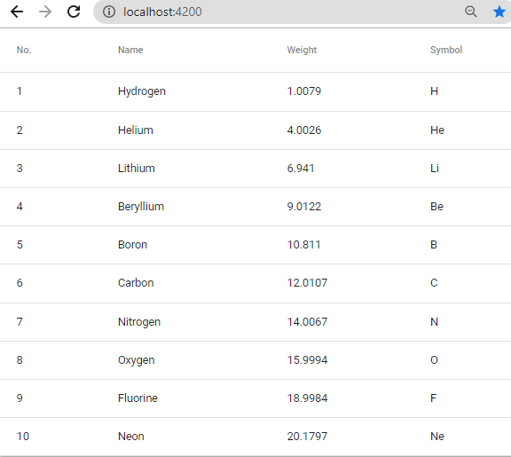
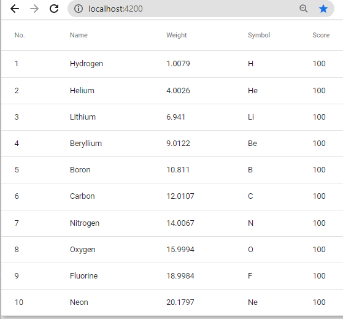
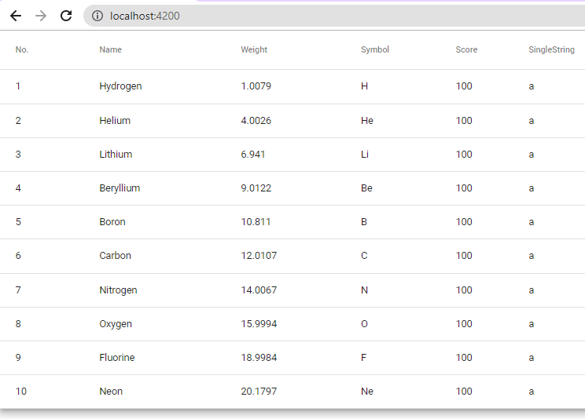

# Mat Table Simple

## Command

```dos
npm install -g @angular/cli
ng new mat-table-simple --routing --stye=css
cd mat-table-simple
npm i -S @angular/material @angular/cdk @angular/animations
ng add @angular/material
```

```
C:\Code\MyAngularMaterial\mat-table\mat-table-simple>ng add @angular/material
Skipping installation: Package already installed
? Choose a prebuilt theme name, or "custom" for a custom theme:
> Indigo/Pink        [ Preview: https://material.angular.io?theme=indigo-pink ]
  Deep Purple/Amber  [ Preview: https://material.angular.io?theme=deeppurple-amber ]
  Pink/Blue Grey     [ Preview: https://material.angular.io?theme=pink-bluegrey ]
  Purple/Green       [ Preview: https://material.angular.io?theme=purple-green ]
  Custom
? Set up global Angular Material typography styles? Yes
? Set up browser animations for Angular Material? Yes
...
```

\*.ts

```
import { MatAutocompleteModule, MatCheckboxModule, MatButtonModule, MatFormFieldModule, MatInputModule, MatDatepickerModule, MatRadioModule, MatSelectModule, MatSlideToggleModule, MatSliderModule  } from '@angular/material';

@NgModule({ imports: [ MatAutocompleteModule, MatCheckboxModule, MatButtonModule, MatFormFieldModule, MatDatepickerModule, MatRadioModule, MatInputModule, MatSelectModule, MatSlideToggleModule, MatSlideToggleModule ]})
```

app.module.ts

```
import { MatTableModule } from '@angular/material/table';
@NgModule({
  imports: [
    MatTableModule,
  ],
```

```
ng serve
```

## Coding

### app.component.html

```
<table mat-table [dataSource]="dataSource" class="mat-elevation-z8">

  <!--- Note that these columns can be defined in any order.
        The actual rendered columns are set as a property on the row definition" -->

  <!-- Position Column -->
  <ng-container matColumnDef="position">
    <th mat-header-cell *matHeaderCellDef> No. </th>
    <td mat-cell *matCellDef="let element"> {{element.position}} </td>
  </ng-container>

  <!-- Name Column -->
  <ng-container matColumnDef="name">
    <th mat-header-cell *matHeaderCellDef> Name </th>
    <td mat-cell *matCellDef="let element"> {{element.name}} </td>
  </ng-container>

  <!-- Weight Column -->
  <ng-container matColumnDef="weight">
    <th mat-header-cell *matHeaderCellDef> Weight </th>
    <td mat-cell *matCellDef="let element"> {{element.weight}} </td>
  </ng-container>

  <!-- Symbol Column -->
  <ng-container matColumnDef="symbol">
    <th mat-header-cell *matHeaderCellDef> Symbol </th>
    <td mat-cell *matCellDef="let element"> {{element.symbol}} </td>
  </ng-container>

  <tr mat-header-row *matHeaderRowDef="displayedColumns"></tr>
  <tr mat-row *matRowDef="let row; columns: displayedColumns;"></tr>
</table>
```

### app.component.ts

```
import {Component} from '@angular/core';

export interface PeriodicElement {
  name: string;
  position: number;
  weight: number;
  symbol: string;
}

const ELEMENT_DATA: PeriodicElement[] = [
  {position: 1, name: 'Hydrogen', weight: 1.0079, symbol: 'H', score: 100},
  {position: 2, name: 'Helium', weight: 4.0026, symbol: 'He', score: 100},
  {position: 3, name: 'Lithium', weight: 6.941, symbol: 'Li', score: 100},
  {position: 4, name: 'Beryllium', weight: 9.0122, symbol: 'Be', score: 100},
  {position: 5, name: 'Boron', weight: 10.811, symbol: 'B', score: 100},
  {position: 6, name: 'Carbon', weight: 12.0107, symbol: 'C', score: 100},
  {position: 7, name: 'Nitrogen', weight: 14.0067, symbol: 'N', score: 100},
  {position: 8, name: 'Oxygen', weight: 15.9994, symbol: 'O', score: 100},
  {position: 9, name: 'Fluorine', weight: 18.9984, symbol: 'F', score: 100},
  {position: 10, name: 'Neon', weight: 20.1797, symbol: 'Ne', score: 100},
];

/**
 * @title Basic use of `<table mat-table>`
 */
@Component({
  selector: 'table-basic-example',
  styleUrls: ['table-basic-example.css'],
  templateUrl: 'table-basic-example.html',
})
export class TableBasicExample {
  displayedColumns: string[] = ['position', 'name', 'weight', 'symbol'];
  dataSource = ELEMENT_DATA;
}
```

### app.component.css

```
table {
  width: 100%;
}
```

## Add a new column

### app.component.html

```
  <!-- Score Column -->
  <ng-container matColumnDef="score">
    <th mat-header-cell *matHeaderCellDef>Score</th>
    <td mat-cell *matCellDef="let element">{{ element.score }}</td>
  </ng-container>
```

Note:

It can be "let" as a different name, i.e. "let user"

### app.component.ts

```
export interface PeriodicElement { ...;  score: number; }

const ELEMENT_DATA: PeriodicElement[] = [
  { ..., score: 100 },
  ...

  displayedColumns: string[] = [ ..., 'score', ];
  ...
```

## Add a new mat-text-column

If your column is only responsible for rendering a single string value for the header and cells, you can instead define your column using the mat-text-column.

### app.component.html

```
  <!-- SingleString Column -->
  <mat-text-column name="SingleString"></mat-text-column>
```

## Screenshot






