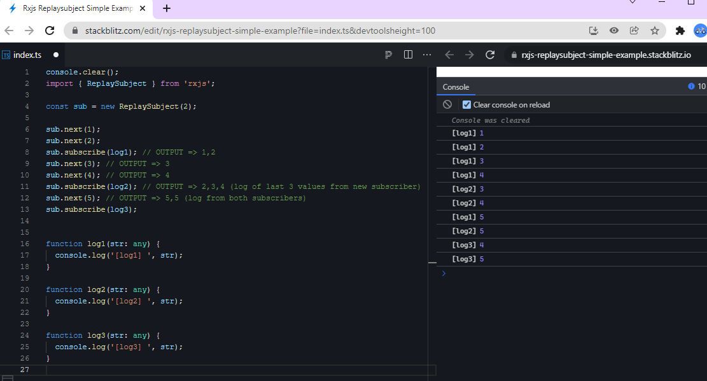

# Mat Table Simple

## Command

```dos
npm install -g @angular/cli
ng new mat-table-simple --routing --stye=css
cd mat-table-simple
npm i -S @angular/material @angular/cdk @angular/animations
npm i -S @angular/flex-layout
ng add @angular/material
npm i -D json-server
ng add @ng-bootstrap/ng-bootstrap
```

```
C:\Code\MyAngularMaterial\mat-table\mat-table-simple>ng add @angular/material
Skipping installation: Package already installed
? Choose a prebuilt theme name, or "custom" for a custom theme:
> Indigo/Pink        [ Preview: https://material.angular.io?theme=indigo-pink ]
  Deep Purple/Amber  [ Preview: https://material.angular.io?theme=deeppurple-amber ]
  Pink/Blue Grey     [ Preview: https://material.angular.io?theme=pink-bluegrey ]
  Purple/Green       [ Preview: https://material.angular.io?theme=purple-green ]
  Custom
? Set up global Angular Material typography styles? Yes
? Set up browser animations for Angular Material? Yes
...
```

\*.ts

```
import { MatAutocompleteModule, MatCheckboxModule, MatButtonModule, MatFormFieldModule, MatInputModule, MatDatepickerModule, MatRadioModule, MatSelectModule, MatSlideToggleModule, MatSliderModule  } from '@angular/material';

@NgModule({ imports: [ MatAutocompleteModule, MatCheckboxModule, MatButtonModule, MatFormFieldModule, MatDatepickerModule, MatRadioModule, MatInputModule, MatSelectModule, MatSlideToggleModule, MatSlideToggleModule ]})
```

app.module.ts

```
import { MatTableModule } from '@angular/material/table';
import { MatPaginatorModule } from '@angular/material/paginator';
import { MatSortModule } from '@angular/material/sort';
@NgModule({
  imports: [
    MatTableModule,
    MatPaginatorModule,
    MatSortModule,
  ],
```

```
C:\Code\MyAngularMaterial\mat-table\mat-table-simple>ng add @ng-bootstrap/ng-bootstrap
ℹ Using package manager: npm
✔ Found compatible package version: @ng-bootstrap/ng-bootstrap@10.0.0.
✔ Package information loaded.

The package @ng-bootstrap/ng-bootstrap@10.0.0 will be installed and executed.
Would you like to proceed? Yes
✔ Package successfully installed.
UPDATE package.json (1811 bytes)
✔ Packages installed successfully.
UPDATE src/app/app.module.ts (2443 bytes)
UPDATE angular.json (3122 bytes)
UPDATE src/polyfills.ts (3049 bytes)
```

angular.json

```
"styles": ["node_modules/bootstrap/dist/css/bootstrap.min.css", "src/styles.css"],
```

```
ng serve
```

## Coding

### app.component.html

```
<table mat-table [dataSource]="dataSource" class="mat-elevation-z8">

  <!--- Note that these columns can be defined in any order.
        The actual rendered columns are set as a property on the row definition" -->

  <!-- Position Column -->
  <ng-container matColumnDef="position">
    <th mat-header-cell *matHeaderCellDef> No. </th>
    <td mat-cell *matCellDef="let element"> {{element.position}} </td>
  </ng-container>

  <!-- Name Column -->
  <ng-container matColumnDef="name">
    <th mat-header-cell *matHeaderCellDef> Name </th>
    <td mat-cell *matCellDef="let element"> {{element.name}} </td>
  </ng-container>

  <!-- Weight Column -->
  <ng-container matColumnDef="weight">
    <th mat-header-cell *matHeaderCellDef> Weight </th>
    <td mat-cell *matCellDef="let element"> {{element.weight}} </td>
  </ng-container>

  <!-- Symbol Column -->
  <ng-container matColumnDef="symbol">
    <th mat-header-cell *matHeaderCellDef> Symbol </th>
    <td mat-cell *matCellDef="let element"> {{element.symbol}} </td>
  </ng-container>

  <tr mat-header-row *matHeaderRowDef="displayedColumns"></tr>
  <tr mat-row *matRowDef="let row; columns: displayedColumns;"></tr>
</table>
```

### app.component.ts

```
import {Component} from '@angular/core';

export interface PeriodicElement {
  name: string;
  position: number;
  weight: number;
  symbol: string;
}

const ELEMENT_DATA: PeriodicElement[] = [
  {position: 1, name: 'Hydrogen', weight: 1.0079, symbol: 'H', score: 100},
  {position: 2, name: 'Helium', weight: 4.0026, symbol: 'He', score: 100},
  {position: 3, name: 'Lithium', weight: 6.941, symbol: 'Li', score: 100},
  {position: 4, name: 'Beryllium', weight: 9.0122, symbol: 'Be', score: 100},
  {position: 5, name: 'Boron', weight: 10.811, symbol: 'B', score: 100},
  {position: 6, name: 'Carbon', weight: 12.0107, symbol: 'C', score: 100},
  {position: 7, name: 'Nitrogen', weight: 14.0067, symbol: 'N', score: 100},
  {position: 8, name: 'Oxygen', weight: 15.9994, symbol: 'O', score: 100},
  {position: 9, name: 'Fluorine', weight: 18.9984, symbol: 'F', score: 100},
  {position: 10, name: 'Neon', weight: 20.1797, symbol: 'Ne', score: 100},
];

/**
 * @title Basic use of `<table mat-table>`
 */
@Component({
  selector: 'table-basic-example',
  styleUrls: ['table-basic-example.css'],
  templateUrl: 'table-basic-example.html',
})
export class TableBasicExample {
  displayedColumns: string[] = ['position', 'name', 'weight', 'symbol'];
  dataSource = ELEMENT_DATA;
}
```

### app.component.css

```
table {
  width: 100%;
}
```

## Add a new column

### app.component.html

```
  <!-- Score Column -->
  <ng-container matColumnDef="score">
    <th mat-header-cell *matHeaderCellDef>Score</th>
    <td mat-cell *matCellDef="let element">{{ element.score }}</td>
  </ng-container>
```

Note:

It can be "let" as a different name, i.e. "let user"

### app.component.ts

```
export interface PeriodicElement { ...;  score: number; }

const ELEMENT_DATA: PeriodicElement[] = [
  { ..., score: 100 },
  ...

  displayedColumns: string[] = [ ..., 'score', ];
  ...
```

## Add a new mat-text-column

If your column is only responsible for rendering a single string value for the header and cells, you can instead define your column using the mat-text-column.

### app.component.html

```
  <!-- SingleString Column -->
  <mat-text-column name="SingleString"></mat-text-column>
```

## More

Styling Columns

Row Template

Pagination

Sorting

SearchFilter

Filtering

Selection ???

Footer

Sticky Rows and Columns

Multiple row templates

Tables with display: flex

Tables with MatRipple

```
ng g c home --dry-run
ng g c home
ng g c pagenotfound
ng g c basic
ng g c styling
ng g c row-template
ng g c pagination
ng g c sorting
ng g c pagesort
ng g c searchfilter
ng g c filter
ng g c selection
ng g c footer
ng g c sticky
ng g c flex
```

```
npm i -D json-server
npx json-server --watch -p 3333 server.json
"mock": "npx json-server --watch -p 3333 data/db.json",
http://localhost:3333/
http://localhost:3333/license
npm run mock
ng g c components\mock --dry-run
ng g c components\mock
ng g s services\licence --dry-run
ng g s services\licence
```

```
ng g s services\loader --dry-run
ng g s services\loader
ng g c components\async-load --dry-run
ng g c components\async-load
```

```
npm i -S @fortawesome/fontawesome-free
npm i -S @fortawesome/free-solid-svg-icons
ng add @fortawesome/angular-fontawesome
```

```
import { FontAwesomeModule } from '@fortawesome/angular-fontawesome';

@NgModule({
  imports: [FontAwesomeModule]
})
export class MaterialModule {}

//any component
import { faGoogle } from '@fortawesome/free-brands-svg-icons';

googleIcon = faGoogle;

//html
<fa-icon [icon]="googleIcon"></fa-icon>
```

```
ng g c components\search --dry-run
ng g c components\search
ng g c components\filterpredicate --dry-run
ng g c components\filterpredicate
ng g c components\odsheaderdefault
ng g c components\odsheaderontario
ng g c components\odsfooterdefault

ng g c components\ods
```

## Json-Server mock

package.json

```
"mock": "npx json-server --watch -p 3333 src/app/data/db.json --routes src/app/data/routes.json",
```

src/app/data/routes.json

```
{
  "/api/v1/licences": "/licences"
}
```

src/app/data/db.json

```
{
  "licences": [
    {
      "licId": 1,
      "licNo": "0000169",
      "licType": "Children's Residence",
      "licName": "Hatts Off Inc.",
      "licPlace": "Dundas",
      "licPhone": "905-521-1555",
      "licCondition": "NA"
    },
    ...
```

app.module.ts

```
import { HttpClientModule } from '@angular/common/http';
...
imports:[HttpClientModule,  ...]
```

src\app\models\license.ts

```
export interface License {
  licId: number;
  licNo: string;
  licType: string;
  licName: string;
  licPlace: string;
  licPhone: string;
  licCondition: string;
}
```

src\environments\environment.ts

```
export const environment = {
  production: false,
  serverUrl: 'http://localhost:3333',
  apiUrl: '/api/v1',
  root: '/',
  version: '1.0',
};
```

src\shared\URLs.ts

```
import { environment } from '@environments/environment';

  ...
  private static SERVER = environment.serverUrl;
  private static API = environment.apiUrl;
  public static LICENCE_ENDPOINT = URLs.SERVER + URLs.API + '/licences';
  ...
```

mock.component.ts

```
  ngOnInit(): void {
    // Using JSON
    //dataSource = new MatTableDataSource<Licence>(LICENSE_DATA);

    // Using mock by JSON-Server or real API
    this.licenceService
      .getLicences()
      // .pipe(takeUntil(this.destroyed$))
      .subscribe(
        (data: any) => {
          console.log('[ngOnInit] data: ', data);
          if (data) {
            this.dataSource.data = data;
          }
        },
        (err: any) => {
          console.log('[ngOnInit] err: ', err);
        }
      );
  }
```


## Loading

```dos
ng g s services\loader
ng g s services\interceptor
```

loader.service.ts

```
export class LoaderService {
  public isLoading: BehaviorSubject<boolean> = new BehaviorSubject<boolean>(
    false
  );
```

interceptor.service.ts

```
export class InterceptorService implements HttpInterceptor {
  constructor(public loaderService: LoaderService) {}

  intercept(
    req: HttpRequest<any>,
    next: HttpHandler
  ): Observable<HttpEvent<any>> {
    this.loaderService.isLoading.next(true);

    return next.handle(req).pipe(
      finalize(() => {
        this.loaderService.isLoading.next(false);
      })
    );
  }
```

mypage.component.html

```
<div
  class="loader-container"
  *ngIf="loaderService.isLoading | async; else elseBlock"
>
  <mat-spinner style="top: 50%; left: 50%"></mat-spinner>
</div>

<ng-template #elseBlock>
  <div>
    <p>Finished loading!!!</p>
  </div>
</ng-template>
```

mypage.component.css

```
.loader-container {
  position: absolute;
  height: 100%;
  width: 100%;
  background: black;
  opacity: 0.8;
  z-index: 99;
}
```

mypage.component.ts

```
  constructor(public loaderService: LoaderService) {}
  ...

    this.loaderService.isLoading.next(true);
    this.licenceService.getLicences().subscribe(
      async (data: any) => {
        if (data) {
          this.dataSource.data = data;
          this.loaderService.isLoading.next(false);
        }
      },
      (err: any) => {
        this.loaderService.isLoading.next(false);
      }
    );
```

## Logs / Branches

```dos
git checkout -b v0.01_get_started main
git checkout -b v0.02_styling main
git checkout -b v0.03_row_template main
git checkout -b v0.04_pagination main
git checkout -b v0.05_sorting main
git checkout -b v0.06_pagesort_v1 main
git checkout -b v0.07_filter main
git checkout -b v0.08_selection main
git checkout -b v0.09_footer main
git checkout -b v0.10_sticky main
git checkout -b v0.11_flex main
git checkout -b v0.12_folder main
git checkout -b v0.13_mock main
git checkout -b v0.14_async_load main
git checkout -b v0.15_search main
git checkout -b v0.16_filterpredicate main
git checkout -b v0.17_filterpredicateV2 main
git checkout -b v0.18_filterpredicateV3 main
git checkout -b v0.19_ODS_header_default main
git checkout -b v0.20_ODS_header_ontario_wip main
git checkout -b v0.21_ODS_footder_default main


git checkout main
git branch -a
git branch

git push --all
```

```dos
C:\Code\MyAngularMaterial\mat-table\mat-table-simple>git branch -a
* main
  v0.01_get_started
  v0.01_styling
  v0.03_row_template
  v0.04_pagination
  v0.05_sorting
  v0.06_pagesort_v1
  v0.07_filter
  v0.09_footer
  v0.10_sticky
  v0.11_flex
  v0.12_folder
  v0.13_mock
  v0.14_async_load
  remotes/origin/main
  remotes/origin/v0.01_get_started
  remotes/origin/v0.01_styling
  remotes/origin/v0.03_row_template
  remotes/origin/v0.04_pagination
  remotes/origin/v0.05_sorting
  remotes/origin/v0.06_pagesort_v1
  remotes/origin/v0.07_filter
  remotes/origin/v0.09_footer
  remotes/origin/v0.10_sticky
  remotes/origin/v0.11_flex
  remotes/origin/v0.12_folder
  remotes/origin/v0.13_mock
```

## Screenshot


## Misc

### Angular UI inline code snippet

html

```
  <pre>
    <code [innerHTML]="css_code"></code>
  </pre>
```

or

```
  <pre>
    <code [innerText]="html_code"></code>
  </pre>
```

ts

```
  css_code = `
    .mat-column-demo-name {
      padding-left: 16px;
      font-size: 20px;
    }
  `;
}
```

### CSS currentColor

You can use this value to indicate you want to use the value of color for other properties that accept a color value: borders, box shadows, outlines, or backgrounds.

currentColor is useful when you want a certain color to be consistent in an element. For example, if you want an element to have a border color that's the same as the element's text color, using currentColor makes a lot of sense because then if you decide the main text color you can change the value at only one place.

The currentColor keyword represents the value of an element's color property. This lets you use the color value on properties that do not receive it by default. If currentColor is used as the value of the color property, it instead takes its value from the inherited value of the color property.

### LiveAnnouncer

```
import { LiveAnnouncer } from '@angular/cdk/a11y';
```

### Troubleshooting - all pages are not found

The following will block all pages after '\*\*'.

```
const routes: Routes = [
  { path: 'home', component: HomeComponent },
  { path: '', redirectTo: 'home', pathMatch: 'full' },
  { path: '**', component: PagenotfoundComponent },
    ...
  { path: 'basic', component: BasicComponent },

];
```

Make sure it stays at the end!

```
const routes: Routes = [
  { path: 'home', component: HomeComponent },
  { path: 'basic', component: BasicComponent },
  ...
  { path: '', redirectTo: 'home', pathMatch: 'full' },
  { path: '**', component: PagenotfoundComponent },
];
```

### Troubleshooting - error NG8002: Can't bind to 'ngModel' since it isn't a known property of 'input'.

app.module.ts

```
import { FormsModule } from '@angular/forms';

[...]

@NgModule({
  imports: [
    [...]
    FormsModule
  ],
  [...]
})
```

### Filtering

The filter filter can only be used on arrays, and it returns an array containing only the matching items.

### Creating a Search Filter

https://dev.to/idrisrampurawala/creating-a-search-filter-in-angular-562d

src/pipes/filter.pipe.ts

app.module.ts

### CSS !important

The !important rule in CSS is used to add more importance to a property/value than normal.

In fact, if you use the !important rule, it will override ALL previous styling rules for that specific property on that element!

### Why need to put it in Style.css?

It doesn't work if put this in searchfilter.component.css

```
.font-weight-bold {
  font-weight: 700 !important;
}
```

The only way to override an !important rule is to include another !important rule on a declaration with the same (or higher) specificity in the source code - and here the problem starts! This makes the CSS code confusing and the debugging will be hard, especially if you have a large style sheet!

```
<style>
#myid {
  background-color: blue !important;
}

.myclass {
  background-color: gray !important;
}

p {
  background-color: red !important;
}
</style>

<!-- red -->
<p>This is some text in a paragraph.</p>

<!-- gray -->
<p class="myclass">This is some text in a paragraph.</p>

<!-- blue -->
<p id="myid">This is some text in a paragraph.</p>

</body>
```

### Use <mat-form-field> instead of <input>

### How to add multiple footers in a mat-table?

### How to move component files to a different folder smartly

1. Create a new folder "src\app\components"

2. Move home component from "src\app\" to "src\app\components\"

3. Click "Yes" or "Always automatically update imports"


4. Save All

## Knowledge Points

### mat-form-field

### MatInputModule

### Sticky Header / Footer / Column

Just a few words -

```
sticky: true
```

Both header <mat-header-row> and footer <mat-footer-row> can be used.

But it won't work for <mat-row>, even add in there :-)

A column can be sticky as well.

```
<tr mat-header-row *matHeaderRowDef="displayedColumns; sticky: true"></tr>

<tr mat-footer-row *matFooterRowDef="displayedColumns; sticky: true"></tr>

<ng-container matColumnDef="name" sticky>
...
```

### Accessibility

Always provide an accessible label for your tables via aria-label or aria-labelledby on the table element.

### Tables with display: flex

<table mat-table> ==> <mat-table>

<tr mat-row> ==> <mat-row>

<th mat-cell> ==> <mat-cell>

<th mat-header-cell> ==> <mat-header-cell>

<th mat-footer-cell> ==> <mat-footer-cell>

### TakeUntil

Emits the values emitted by the source Observable until a notifier Observable emits a value.

takeUntil<T>(notifier: ObservableInput<any>): MonoTypeOperatorFunction<T>

The takeUntil operator is used to automatically unsubscribe from an observable. takeUntil begins mirroring the source Observable. It also monitors a second Observable, notifier that you provide.


Tick every second until the first click happens.

```
import { fromEvent, interval } from 'rxjs';
import { takeUntil } from 'rxjs/operators';

const source = interval(1000);
const clicks = fromEvent(document, 'click');
const result = source.pipe(takeUntil(clicks));
result.subscribe(x => console.log(x));
```

### ReplaySubject

ReplaySubject is a variant of a Subject which keeps a cache of previous values emitted by a source observable and sends them to all new observers immediately on subscription.

ReplaySubject will replay the cached sequence of values even if the observer subscribes much later than the values were cached.

```
console.clear();
import { ReplaySubject } from 'rxjs';

const sub = new ReplaySubject(2);

sub.next(1);
sub.next(2);
sub.subscribe(log1); // OUTPUT => 1,2
sub.next(3); // OUTPUT => 3
sub.next(4); // OUTPUT => 4
sub.subscribe(log2); // OUTPUT => 2,3,4 (log of last 3 values from new subscriber)
sub.next(5); // OUTPUT => 5,5 (log from both subscribers)
sub.subscribe(log3);


function log1(str: any) {
  console.log('[log1] ', str);
}

function log2(str: any) {
  console.log('[log2] ', str);
}

function log3(str: any) {
  console.log('[log3] ', str);
}
```



### mat-progress-spinner for loader

```
import { MatProgressSpinnerModule } from '@angular/material/progress-spinner';
```

### MatDialogConfig

...

### DOCUMENT

```
import { DOCUMENT } from '@angular/common';
```

### Search

### PhoneNumber

### Animation

### LiveAnnouncer

### console.clear()

### Turn off null check in TypeScript config

Set strictNullChecks=false in tsconfig.json

### JSON.parse()

The JSON.parse() method parses a JSON string, constructing the JavaScript value or object described by the string.

### @angular/flex-layout

Very tricky!

Too many tricks!

Without installing flex-layout, no errors or warnings for flex syntax.

But it won't work!

```dos
npm i -S @angular/flex-layout
```

app.module.ts

```
import { FlexLayoutModule } from '@angular/flex-layout';
...

@NgModule({
    ...
    imports: [ FlexLayoutModule ],
    ...
});
```

### Angular double exclamation mark

In some cases you may want to cast a variable to be explicitly boolean. Why? Well, the number one reason is that most of time developers do not use type safe comparison operators.

The type safe comparison operators are:

Strictly equal: ===

Strictly unequal: !==

```
function() {
  var name = 'Brian';

  //alert 'string'
  window.alert(typeof name);

  //cast to boolean
  var bool = !!name;

  //alert 'boolean'
  window.alert(typeof bool);
}
```

```
!!null
false

!!''
false

!!undefined
false

!!'B'
true

!!' '
true

Number(false)
0

Number(true)
1
```

### ...

## TODO

- @ViewChild

- @Injectable

- MatDialogConfig
